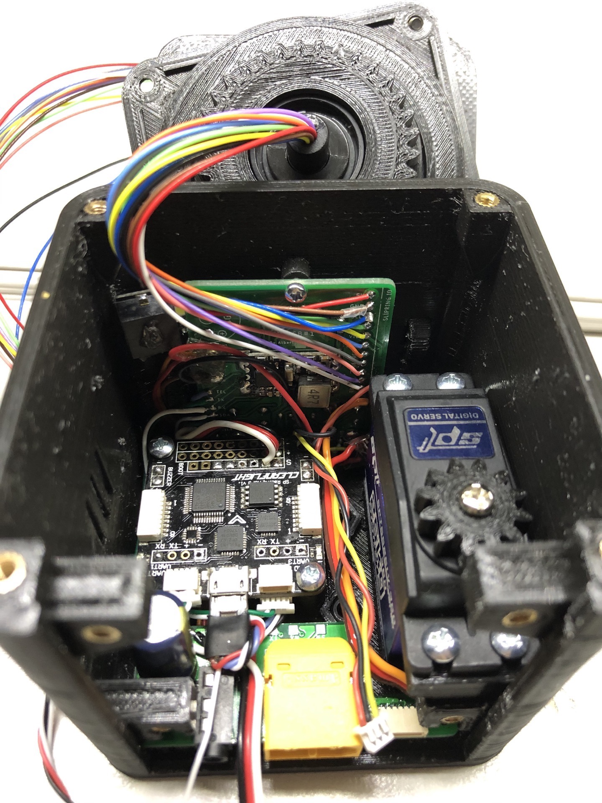

# u360gts *(mini build notes)*

### Features

- DIY antenna tracker based on u360gts by Raul Ortega  [https://github.com/raul-ortega/u360gts/](https://github.com/raul-ortega/u360gts/)
- compact design, only 75x75x100cm
- custom PCBs to simplify wiring
- modular tripod mounts
- supports 2-4S, XT60 connector
- 3.5mm analog Video-Out (Fatshark compatible)
- 6-Pin JST-SH breakout port (SW/RX/TX/5V/GND/VIDEO) to support:
  - telemetry relay to GS/tablet
  - connect external VTX
  - OpenLog via softserial
  - Bluetooth Module to configure u360gts
  - ...through 3 configurable pins(SW/RX/TX)
- 6-Pin JST-XH AV IO port (VIDEO/AUD_L/AUD_R/GND/VCC/GND) to connect an external RX-Module (i.e. FR632)
- intergrated Fatshark Module Bay on the head
- Telemetry input via Bluetooth or FSK-Modem, select via switch on head
- advanced controlling through u360gts-ctrl:
 - Turn ON/OFF the VTX
 - SmartAudio channel control
 - Battery monitoring
 - Manually control PAN (to access screws for example)
 - Infrared supported autonomous parking mode to align tracker


##### u360gts-ctrl

- manual PAN control via u360gts-ctl (to access the screws for example)
- Infrared supported Auto-Home position


## General build tips and notes

## u360gts Mini
#### Printing

All parts are designed to be printed without supports (only supports touching build plate on some parts).

If your parts suffer from an elephant foot, decrease first layer flow, temperature, horizontal expansion and/or walls. Gear parts might not fit!

#### Assembly PCBs

solder the buzzer to the side of the PCB and not as shown on the PCB itself to ensure clearance.

Isolate the back of the 128x64 display and remove the plastics on the pin headers for correct fit.

add a little button to the boot pins of the FC & thank me later
	
#### Assembly body

Prefit IR diode to the hole in the body-lid (used to reach home parking position) and if needed open hole with a drill. Same in the IR-LED in the bottom of the head.

Bottom left nut holder might needs a trim to ensure clearance to the 9pin header of the power PCB.

Place nuts early and fix with some glue.

The gears should not sit on each other and tilt the head to the side if correctly assembled.

#### Assembly head

Two versions of the slipring are currently supported. 23mm (AliExpress) and 26mm long (Sparkfun ROB-13065). Choose your "Bearing\_upper\_insert" STL accordingly.

Cut down the two little spars on the tilt servo so it seats flush on the wall


Solder the IO board to the slipring from "behind" for easier cable routing


Make sure all components (BT Module, RX Board etc.) are well isolated on the back to not create a short when closing the lid


#### Wiring

In general, try to route all cables below the FC when possible.

The Buzzer on the OLED board is connected to (+) through OLED-PCB and only needs GND to work. You can use BZ(+) to route 5V to the power PCB and then to power the CTRL board from the pads on top.

BZ(-) on the OLED board can be connected to the FC BZ(-) as well as the CTRL BZ(-) to run by both.

Only 11 pins between the body and the head are needed, use 2 cables for GND through the slipring

For PCBs prior 05/2020 you need to solder the diode in opposite direction (marking should be on the left).
	
Use a second 5V BEC for the PAN servo, as adviced in the partlist and wiring plan. 

RX/TX/SW on the Power PCB are currently not used. You can use those pads to route anything to the 6pin connector on the back (Relay VTX, openLog etc.)

Solder the wires of the OLED PCB to the slipring directing to the top of the PCB in a slight bow.





#### Wiring schema


## u360gts Controller

#### Hardware

For PCBs prior 05/2020 you need to solder the IR emitter with reverse polarization. The boards also require a little hack to correct a routing mistake:<br>

• Remove R2 (don't throw it away)<br>
• bridge the two pads where R2 was sitting<br>
• solder the R2 to the outer side of the R6<br>
• connect 5V (BZ+) to the outer side of R2<br>
• Connect the IR LED (cathode on IR+, anode on IR-)<br>


Use two or three layer of electrical tape between Arduino Pro Micro and the PCB and remove the plastic spacers on the pin headers to ensure clearance to the gear section.

For TBS Unify Pro Nano, which uses SmartAudio Lite, connect a 10K resistor between SA and GND.

The 4066 switch on CTRL PCB with the edge DOWN, when the PCB shows upwards description.

**Important:** The CTRL will provide VCC to the VTX on the SW (switched) pad. Use a mini-BEC if a 5V VTX is planned (i.e. Pololu D24V3F)5 .

Handle the display with exta care. They seem to break easily. Maybe even get spares right away.


#### Software

If your PAN servo does move without command (in manual pan mode, or after the parking is completed), adjust **idle_servo** to match your servo-center-values.

Depending your choice of Arduino you might need to adjust the **voltage_scale**. If default _3.70_ does not match, try _5.56_

If home parking does not work, ensure IR diodes are working (see hardware section) and validate the IR reading in code. 

Enable the following lines in the Relay_CTRL.ino at line 1368-1269:


```
 //    Serial.println(ir_value); 
 //    delay(10); 
```

Then connect via the arduino IDE serial monitor should show the raw IR value like this during the parking process:

```
 522			<--- moving
 522			|
 521			|
 518			|
 452			<--- coming closer
 38				<--- reached ir_stop_value threshold, stops
```

#### Special Arduino Notes

on 3.3V/5V switchable Arduino Pro Micro (16Mhz resonator) use can use the Leonardo target.

on 3.3V fixed Arduinos (8Mhz resonator) follow this guide to enable the Sparkfun Pro Micro 3.3V/8Mhz target:
[https://learn.sparkfun.com/tutorials/pro-micro--fio-v3-hookup-guide/installing-mac--linux](https://github.com/raul-ortega/u360gts/blob/master/wiki/configuration-pan-servo.md)

In case you flashed with the wrong target, and your tty/cu/COM device disappeared, try to force to bootloader by shorting GND+RST twice. Your tty should appear for about 8 seconds to flash the correct hex.
This needs a good timing and might be tricky. 
You might want to extract the avrdude commands after settings the IDE to verbose, then pre-combile the sketch to .hex file and then write the .hex via avrdude manually.
This also works straight directly from Arduino IDE (klick upload, then short reset twice an the micro and it should find a com port and upload the code)
	

===


## Telemetry setup

Remark: Telemetry input doesn't work with R9M ACCESS at this time. <br>
In this example I am using Crossfire. CRSF RX connected to an FC UART and serial RX is set to CRSF.

#### A simple telementy test (CROSSFIRE/X9D/WIRE)
Connect your radio the the flightcontroller via cable.

note: Serial Bridge via Cable through de-inverter ([https://oshpark.com/shared_projects/V3HPfIeN](https://oshpark.com/shared_projects/V3HPfIeN)) needs GND.

```
	Radio		 	 _______________		FC
	GND			|		| 	->	GND
	VCC	->		|  de-inverter	| 	->	n/a
	SIG			|_______________| 	->	RX on FC
```

Set the OpenTX Serial Port to "Telem Mirror" in the Hardware page of your radio settings. Choose CROSSFIRE protocol with baudrate 115200 on the u360gts.

**If "Telem Mirror" is not available, please upgrade your OpenTX later than 2.3x**

Connect a battery on your plane and wait until Sats are found. 

You should receive coordinates of the plane in the tracker now.

===
#### Bluetooth setup

Connect your BT module to an FTDI USB adapter.
Open Arduino serial terminal, make sure you baud 
rate matches the factory settings of the module.
Type AT and you should get an "OK" back if everything is working

The BT module might behave differently based on revision and firmware.


##### How to bind a HC-05 FW 3.0 with a HC-05 FW 4.0

Both versions will blink every 2 second if AT mode is active

Get the configuration and address of both modules first.
colon (:) must be entered as comma (,)


###### Master (Radio) FW3.0
	- to enter AT mode no need to push the button, just connect EN and pull high from code
	- PIN needs to be "quoted"
	- request commands like AT+VERSION
	
	AT+VERSION
		3.0-20170601
	AT+NAME=X9D
	AT+UART=115200,0,0
	AT+ROLE=1
	AT+CMODE=1
	AT+PIN="1234"
	AT+ADDR=9999,88,F97D84
	AT+BIND=11,22,917BF

###### Slave (Tracker) FW4.0
	to enter AT mode I had to push the button when powering on
	no quotes around PIN
	request commands needed to end with ? like AT+VERSION?

	AT+VERSION?
		4.0-20190815
	AT+NAME=U360
	AT+UART=115200,0,0
	AT+ROLE=0
	AT+CMODE=0
	AT+PSWD=1234
	AT+ADDR=11,22,0917BF
	AT+BIND=9999,88,F97D84

###### validation commands:

	AT+VERSION?
	AT+NAME?
	AT+UART?
	AT+ROLE?
	AT+CMODE?
	AT+PSWD?
	AT+ADDR?
	AT+BIND?

=== 

##### How to bin a HM10 BLE Module connecting to Horus build-in BLE Module
(Version: HMSoft V533 or V610)<br>
You can check you version with AT+VERR? or AT+VERS?

Taranis side:
* Go to hardware menu and enable Bluetooth Telemetry
* Note the Local address of the BT module (from your radio screen)

HM10 Side:<br>
Connect your BT module to an FTDI USB adapter.
Open Arduino serial terminal, make sure you baud 
rate matches the factory settings of the module.
Type AT and you should get an "OK" back if everything is working

	* Make sure the password is 000000
	AT+PASS000000
	* Set the module to Central Role
	AT+ROLE1
	* Set the baud rate to 115200
	AT+BAUD4
	* Link the module to your radio by using the local address
	AT+CON4C249837C8F4 (replace numbers with your Mac address)

## Software setup

1) connect via CLI and type "status", check for MAG="HMC5883"

```
System Uptime: 19 seconds, Voltage: 0 * 0.1V (3S battery - OK)
CPU Clock=72MHz, GYRO=MPU6050, ACC=MPU6050.n, MAG=HMC5883, GPS=2
Cycle Time: 1005, I2C Errors: 1, config size: 1928
```


2) calibrate PAN

   - see [https://github.com/raul-ortega/u360gts/blob/master/wiki/configuration-pan-servo.md](https://github.com/raul-ortega/u360gts/blob/master/wiki/configuration-pan-servo.md)
   - run the calibration in GUI
   - it should rotate counter-clock wise, stop, piep and then rotate clockwise
 
3) calibrate MAG 

  - see [https://github.com/raul-ortega/u360gts/blob/master/wiki/configuration-compass.md](https://github.com/raul-ortega/u360gts/blob/master/wiki/configuration-pan-servo.md)
  - set **offset** and **offset-trim** to 0 via CLI
  - fix your Mag PCB and dont touch/move it 
  - run the calibration in GUI
  - it should rotate at least 360 degrees here (lower starting calibration pulse if not)
    - depending on the result, set align_mag
    - save, reboot, re-calibrate
    - repeat until it directs North, OLED "H:" should be around 360/0
  - if your antenna does not point North now, adjust **offset** accordingly
  - it should try to point North if all works correctly now
  - fyi: offset-trim can be set while flying via the buttons when the aircraft is above min distance/altitude limits
  - todo: explain/validate align_mag / offset / offset-trim (marc?)
 
4) run calibrate PAN again

  - [optionally] set the "startin Calibration Pulse" to 1100 to make it spin faster when calibrating in the field for example
  - re-run the calibration in GUI

5) setup telemetry
  - set your provider, i.e. iNav
  - choose your protocol (CROSSFIRE not available in GUI atm) and baudrate 115200

6) recommended features:

  - enable Tilt easing for soft start/stop
  - enable EPS to allow the tacker to *lead* the aircraft while moving
  - todo: explain and recommend a mode + settings here #FIXME
  - enable auto-update-home position #FIXME: correct option name here

  
## Operation when flying

- calibrate the Mag
- ensure video relay works
  - video from aircraft get received on tracker
  - video from tracker gets received on google
- wait for telemetry from aircraft and set HOME-POSITION when you got a 3D GPS fix (if not set to auto)
- launch aircraft
**todo :)** #FIXME


## Troubleshooting

u360gts-configurator does not connect to tracker via USB

	- MSP baudrate is defined by the telemetry baudrate, choose 115200 via the buttons to match the COM/tty baudrate in the GUI
	- disconnect the BT module in the tracker when using USB if you have problems

Simulation mode not working

	- connect your tracker to power and USB to your computer
	- choose MAVLINK, bautrate 115200 in the u360
	- home position?! set auto in GUI? (#FIXME)
	- enable simulation mode, then connect to your tty/COM of the FC
	- choose MAVLINK in the UI, enter near by coordinates and some height
	- hit "start simulation"
    
Tracker "shakes" head / PAN moves when TILT moves

	- due to metall and other interference the mag might reports ocillating data
	- try to relocate the mag-board to another location
	- replace metall with plastics where possible (screw inserts, screws, bearings) 
	- add 10K pullup resistors between SDA and 5V, SCL and 5V

 
### additional Resources:
 
  - [https://github.com/raul-ortega/u360gts/blob/master/wiki/configuration-quick-start-guide.md](https://github.com/raul-ortega/u360gts/blob/master/wiki/configuration-quick-start-guide.md)
  - [PCB to de-invert Taranis Telemetry for Bluetooth](https://oshpark.com/shared_projects/V3HPfIeN)
