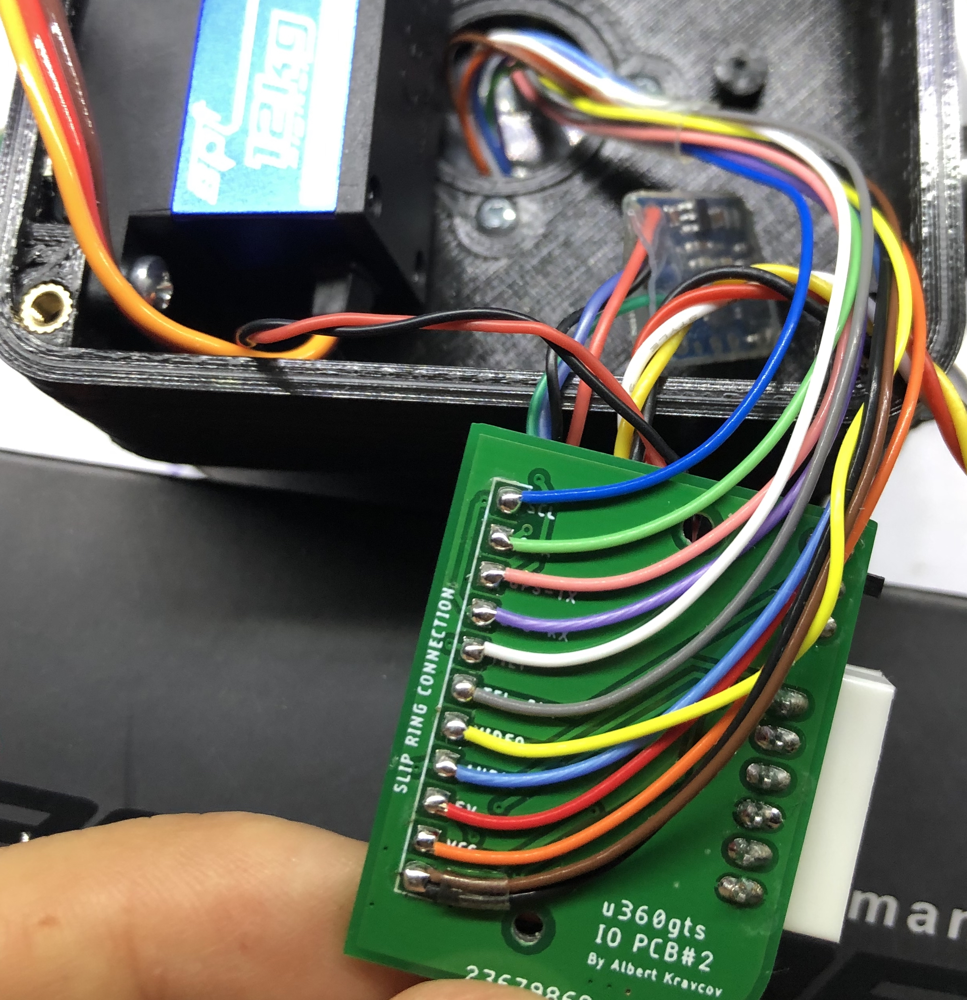
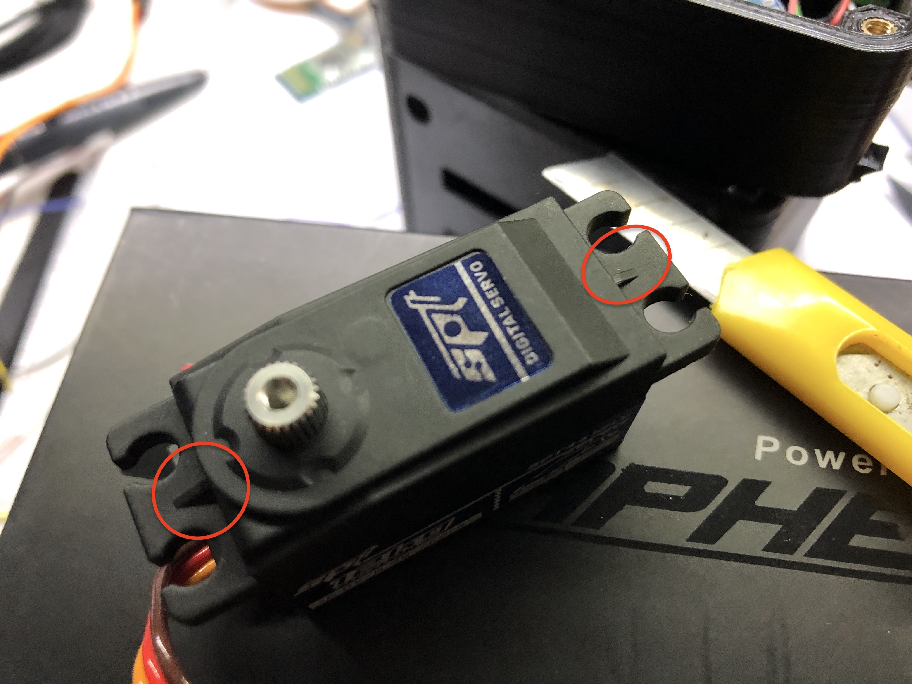
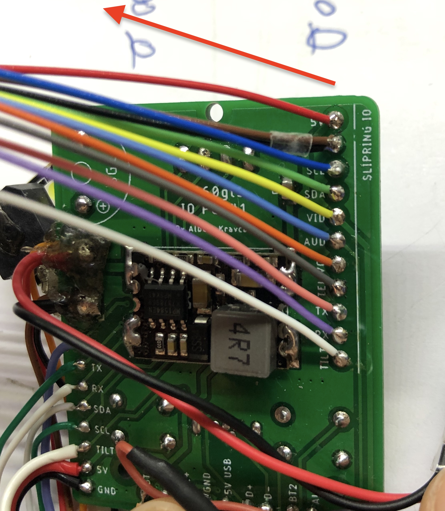
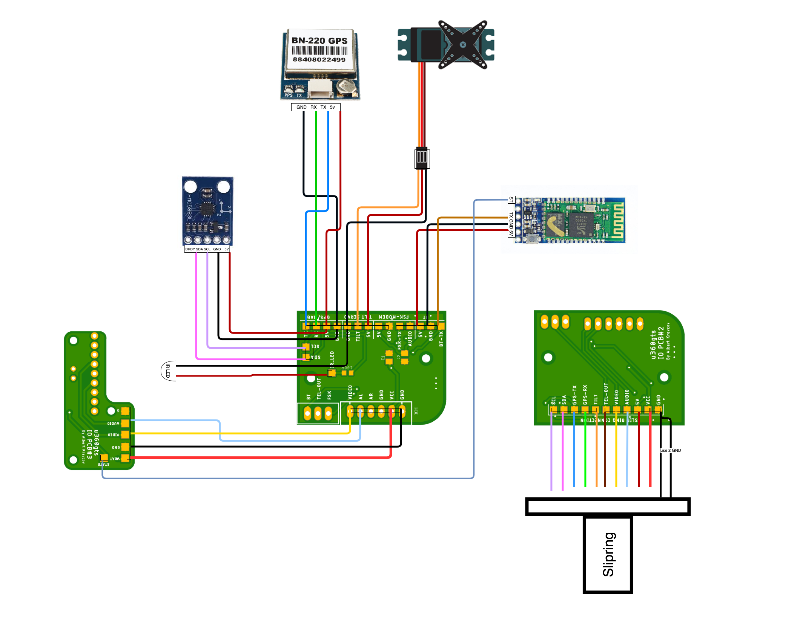
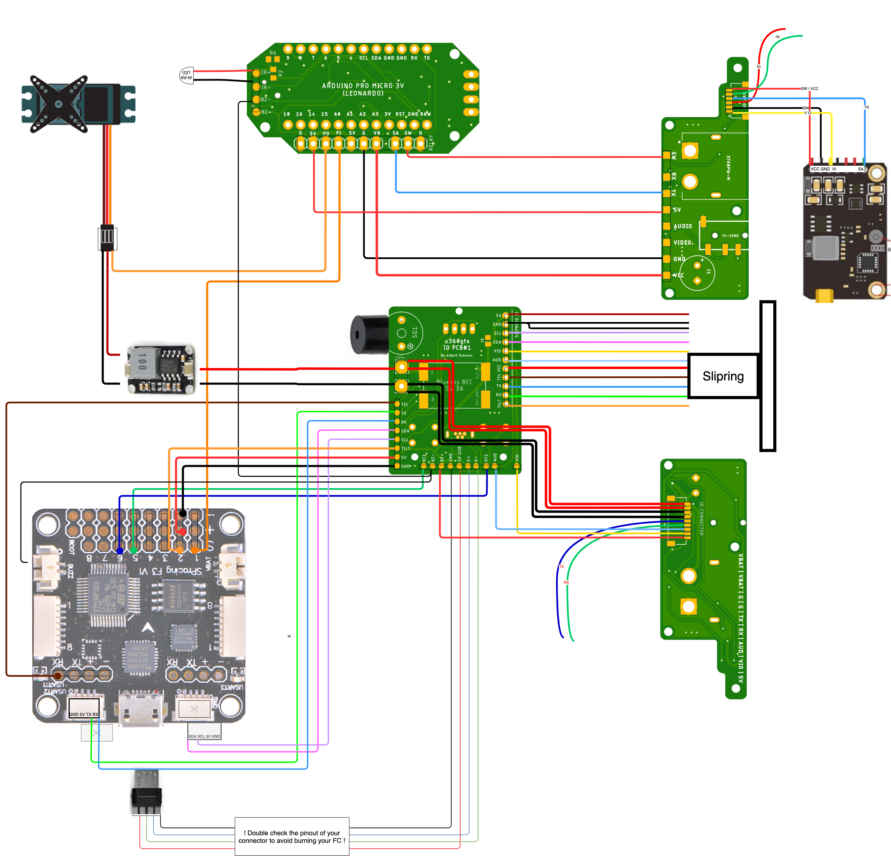
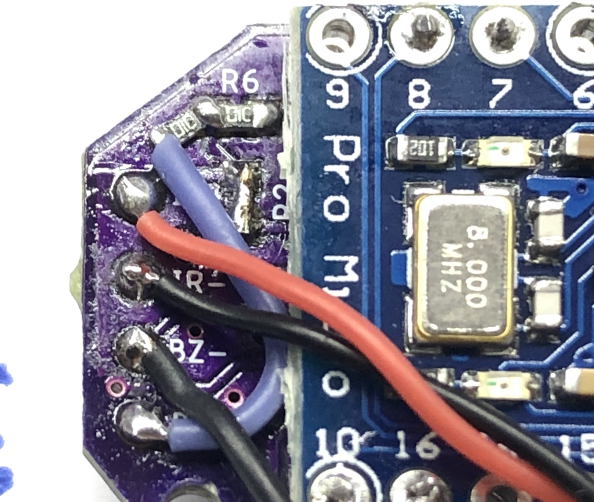

# u360gts *(mini build notes)*

### General build tips and notes

#### printing

All parts are designed to be printed without supports (only supports touching build plate on some parts).

If your parts suffer from an elephant foot, decrease first layer flow, temperature, horizontal expansion and/or walls. Gear parts might not fit!

#### assembly PCBs

solder the buzzer to the side of the PCB and not as shown on the PCB itself to ensure clearance.

Isolate the back of the 128x64 display and remove the plastics on the pin headers for correct fit.
	
#### assembly body

Prefit IR diode (used to reach home parking position) and if needed open hole with a drill.

Bottom left nut holder might needs a trim to ensure clearance to the 9pin header of the power PCB.

Place nuts early and fix with some glue.

Two versions of the slipring are currently supported. 23mm (AliExpress) and 26mm long (Sparkfun ROB-13065). Choose your "Bearing_upper_insert" STL accordingly.
(The Sparkfun version will be updated shortly on Thingiverse)

The gears should not sit on eachother and lean the head to the side if correctly assembled.

#### assembly head

Solder the IO board to the slipring from "behind" for easier cable routing


Make sure all components (BT Module, RX Board etc.) are well isolated on the back to not create a short when closing the lid

Cut down the two little spars on the tilt servo to seat it flush to the print



#### wiring

In general, try to route all cables below the FC when possible.

The Buzzer on the OLED board is connected to (+) through OLED-PCB and only needs GND to work. 

BZ(-) on the OLED board can be connected to the FC BZ(-) as well as the CTRL BZ(-) to run by both.

Only 11 pins between the body and the head are needed, use 2 cables for GND through the slipring

For PCBs prior 05/2020 you need to solder the diode in opposite direction (marking should be on the left).
	
Use a second 5V BEC for the PAN servo as adviced in the partlist and wiring plan. 

RX/TX/SW on the Power PCB are currently not used. You can use those pads to route anything to the 6pin connector on the back (Relay VTX, openLog etc.)

Solder the wires of the OLED PCB to the slipring directing to the top of the PCB in a slight bow.


#### wiring schema




### u360gts Controller

#### Hardware

For PCBs prior 05/2020 you need to solder the IR emitter with reverse polarization. The boards also require a little hack to correct a routing mistake:<br><br>

• Remove R2 (don't throw it away)<br>
• bridge the two pads where R2 was sitting<br>
• solder the R2 to the outer side of the R6<br>
• connect 5V (BZ+) to the outer side of R2<br>
• Connect the IR LED (cathode on IR+, anode on IR-)<br>



Use two or three layer of electrical tape between Arduino Pro Micro and the PCB and remove the plastic spacers on the pin headers to ensure clearance to the gear section.

For TBS Unify Pro Nano, which uses SmartAudio Lite, connect a 10K resistor between SA and GND.

The 4066 switch on CTRL PCB with the edge DOWN, when the PCB shows upwards description.

**Important:** The CTRL will provide VCC to the VTX. Use a mini-BEC if a 5V VTX is planned (i.e. Pololu D24V3F)5 .


#### Software

If your PAN servo does move without command (in manual pan mode, or after the parking is completed), adjust **idle_servo** to match your servo-center-values.

Depending your choice of Arduino you might need to adjust the **voltage_scale**. If default _3.70_ does not match, try _5.56_

If home parking does not work, ensure IR diodes are working (see hardware section) and validate the IR reading in code. 

Enable the following lines in the Relay_CTRL.ino at line 1368-1269:


```
 //    Serial.println(ir_value); 
 //    delay(10); 
```

Then connect via the arduino IDE serial monitor should show the raw IR value like this during the parking process:

```
 522			<--- moving
 522			|
 521			|
 518			|
 452			<--- coming closer
 38				<--- reached ir_stop_value threshold, stops
```

#### Special Arduino Notes

on 3.3V/5V switchable Arduino Pro Micro (16Mhz resonator) use can use the Leonardo target.

on 3.3V fixed Arduinos (8Mhz resonator) follow this guide to enable the Sparkfun Pro Micro 3.3V/8Mhz target:
(https://learn.sparkfun.com/tutorials/pro-micro--fio-v3-hookup-guide/installing-mac--linux)

Incase you flashed with the wrong target, and your tty/cu/COM device disappeared, try to force to bootloader by shorting GND+RST twice. Your tty should appear for about 8 seconds to flash the correct hex.
	

===


===


### Telemetry test procedure
##### simple Telmetry test (CROSSFIRE/X9D)
Connect your radio the the flightcontroller via cable.

note: Serial Bridge via Cable through de-inverter needs GND.

```
  Radio			|  				|	FC
  GND			| 				| 	-> GND
  VCC	-> 		| de-inverter	| 	-> n/a
  SIG			| 				| 	-> RX on FC
```

Set the OpenTX Serial Port to "Telem Mirror" in the Hardware page of your radio settings. Choose CROSSFIRE protocol with baudrate 115200 on the u360gts.

** If "Telem Mirror" is not available, please upgrade your OpenTX later than 2.3x **

Connect a battery on your plane and wait until Sats are found. 

You should receive coordinates of the plane in the tracker now.

===
#### Bluetooth setup


Connect your BT module to an FTDI USB adapter.
Open Arduino serial terminal, make sure you baud 
rate matches the factory settings of the module.
Type AT and you should get an "OK" back if everything is working

The BT module might behave differently based on revision and firmware.


__Here is an example of binding a HC-05 FW 3.0 with a HC-05 FW 4.0.__

Both versions will blink every 2 second if AT mode is active


###### Master (Radio) FW3.0
	to enter AT mode no need to push the button, just connect EN and pull high from code
	PIN needs to be "quoted"
	request commands like AT+VERSION
	
	VERSION:3.0-20170601
	+NAME:X9D
	+UART:115200,0,0
	+ROLE:1
	+CMODE:1
	+PIN:"1234"
	+ADDR:9999:88:F97D84
	+BIND:11:22:917BF

###### Slave (Tracker) FW4.0
	to enter AT mode I had to push the button when powering on
	no quotes around PIN
	request commands needed to end with ? like AT+VERSION?

	+VERSION:4.0-20190815
	+NAME:U360
	+UART:115200,0,0
	+ROLE:0
	+CMODE:0
	+PSWD:1234
	+ADDR:11:22:0917BF
	+BIND:9999:88:F97D84

###### validation commands:

	AT+VERSION?
	AT+NAME?
	AT+UART?
	AT+ROLE?
	AT+CMODE?
	AT+PSWD?
	AT+ADDR?
	AT+BIND?

=== 

__AT Commands for HM10 BLE Module connecting to Horus BLE Module__
(Version: HMSoft V533)
You can check you version with AT+VERR? or AT+VERS?

Taranis side:
* Go to hardware menu and enable Bluetooth Telemetry
* Note the Local address of the BT module


HM10 Side:
Connect your BT module to an FTDI USB adapter.
Open Arduino serial terminal, make sure you baud 
rate matches the factory settings of the module.
Type AT and you should get an "OK" back if everything is working

	* Make sure the password is 000000
	AT+ PASS000000
	* Set the module to Central Role
	AT+ROLE1
	* Set the baud rate to 115200
	AT+BAUD4
	* Link the module to your radio by using the local address
	AT+CON4C249837C8F4 (replace numbers with your Mac address)

=== 
